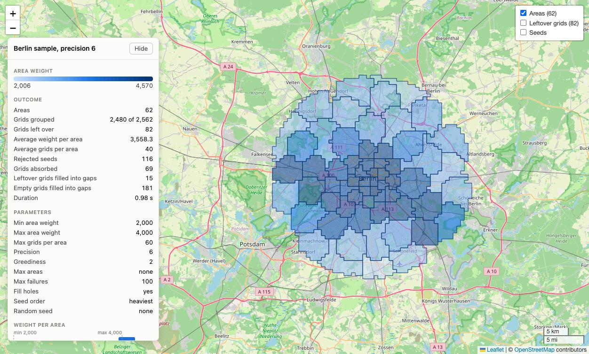
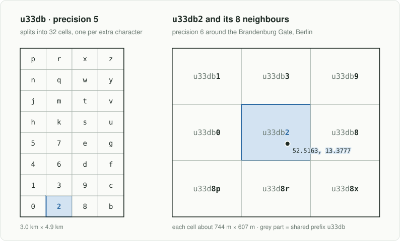
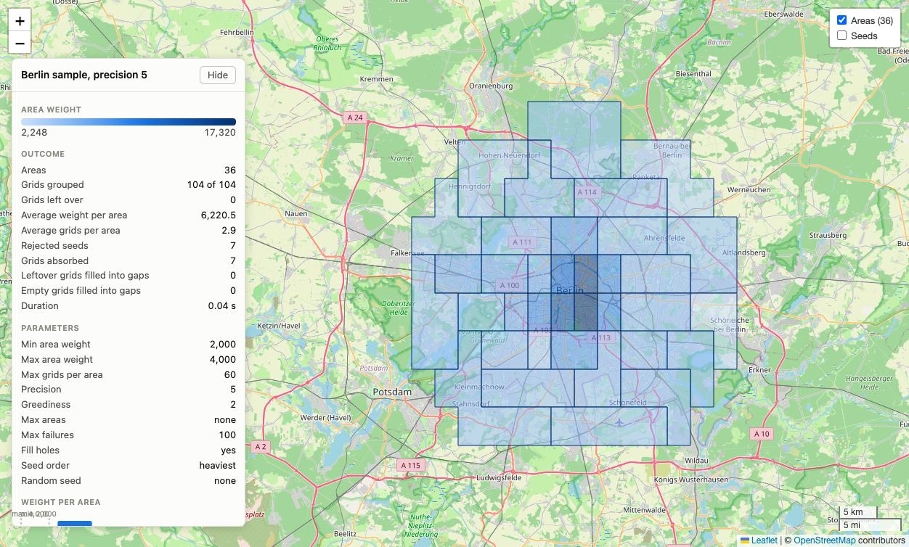

# GeohashPartition

**Constraint-based geographic partitioning with geohash grids.**



*The `areas-map.html` generated for the bundled Berlin sample: 62 areas shaded
from light to dark by weight, with the run's outcome and parameters in the side
panel.*

GeohashPartition assembles geohash grids into connected, weight-balanced areas.
Give it a two-column CSV of geohash and weight, a pandas DataFrame, or a list
of dicts. Tell it how heavy and how big an area may be, and it tiles your
territory into compact areas that each carry a comparable amount of weight.

The weight is whatever matters in your domain: orders, customers, people, dogs,
parcels, incidents, revenue. GeohashPartition never asks what it means.

Typical uses: sales territories, delivery zones, advertising placements, field
service districts, census-style aggregation, any "split this map into fair
chunks" problem.


**Zero dependencies.** Distances use the haversine formula, point-in-polygon
uses ray casting, and area outlines come from cancelling shared grid edges.
There is no shapely, geopandas, GDAL or numpy anywhere.

## What is a geohash?

A geohash is a short text code for a rectangle on the Earth's surface. The
world is split into 32 cells, each named by one character. Every cell is split
into 32 smaller cells, and so on, so each extra character zooms in. Longer
codes mean smaller cells, and places whose codes share a prefix are close
together.

The codes use the digits `0` to `9` and the lowercase letters except `a`, `i`,
`l` and `o`. Gustavo Niemeyer invented the system in 2008 and released it into
the public domain.

Zooming in on the Brandenburg Gate in Berlin:

| Precision | Geohash | Cell width x height |
|---|---|---|
| 2 | `u3` | about 750 km x 620 km |
| 4 | `u33d` | about 24 km x 19 km |
| 5 | `u33db` | about 3 km x 4.9 km |
| 6 | `u33db2` | about 740 m x 610 m |
| 7 | `u33db2m` | about 90 m x 150 m |

Cells get narrower away from the equator, so the same precision covers less
ground in Berlin than in Singapore.

In GeohashPartition, each geohash at your chosen `precision` is one grid: the
building block that areas are assembled from. Longer input geohashes are cut
to that precision, and their weights are added up.

### From coordinates to a geohash grid



The geohash functions GeohashPartition uses internally are yours to use too.
Turn a latitude and longitude into a geohash, get its rectangle, and list the
grid around it:

```python
from geohash_partition import bbox, encode, neighbors

lat, lon = 52.5163, 13.3777            # Brandenburg Gate, Berlin
cell = encode(lat, lon, precision=6)
print(cell)
print(bbox(cell))                      # (min_lat, min_lon, max_lat, max_lon)

# the 3 x 3 grid around it
n = neighbors(cell)                    # {'n': ..., 'e': ..., 's': ..., 'w': ...}
grid = [
    [neighbors(n["n"])["w"], n["n"], neighbors(n["n"])["e"]],
    [n["w"],                 cell,   n["e"]],
    [neighbors(n["s"])["w"], n["s"], neighbors(n["s"])["e"]],
]
for row in grid:
    print(" ".join(row))

# coarser or finer grids: just change the precision
print([encode(lat, lon, precision=p) for p in (4, 5, 6, 7)])
```

```text
u33db2
(52.5146484375, 13.370361328125, 52.5201416015625, 13.38134765625)
u33db1 u33db3 u33db9
u33db0 u33db2 u33db8
u33d8p u33d8r u33d8x
['u33d', 'u33db', 'u33db2', 'u33db2m']
```

The bottom row starts with `u33d8`, not `u33db`. Those cells lie just south of
the edge of `u33db`, which is why the prefix rule is "usually close", not
"always the same prefix".

To use your own points as input, count them per geohash. The counts become the
weights:

```python
from collections import Counter

from geohash_partition import encode, partition

# your own data: one (lat, lon) per event, sighting, customer, ...
points = [
    (52.5163, 13.3777), (52.5170, 13.3790), (52.5155, 13.3760),
    (52.5200, 13.4050), (52.5210, 13.4040), (52.5070, 13.3900),
]
weights = Counter(encode(lat, lon, precision=6) for lat, lon in points)
print(weights)

result = partition(weights, min_area_weight=2, max_area_weight=4)
print([(area.id, area.weight) for area in result.areas])
```

```text
Counter({'u33db2': 3, 'u33dc0': 1, 'u33dc1': 1, 'u33d8w': 1})
[('u33db2', 3), ('u33dc0', 2)]
```

The same `weights` can be written out as a two-column CSV of geohash and weight
for the command line tool.

Learn more:

- [Geohash on Wikipedia](https://en.wikipedia.org/wiki/Geohash) explains the
  encoding step by step, including the edge cases at the equator, the
  meridians and the poles.
- [Movable Type geohash tool](https://www.movable-type.co.uk/scripts/geohash.html)
  encodes and decodes geohashes interactively.
- [Elasticsearch geohash grid reference](https://www.elastic.co/docs/reference/aggregations/search-aggregations-bucket-geohashgrid-aggregation)
  has a table of cell sizes at the equator for each precision.

## Install

GeohashPartition is installed and run with [uv](https://docs.astral.sh/uv/).

```bash
uv add geohash-partition                 # add it to your uv project
uvx geohash-partition --help             # or run the command without installing
uv tool install geohash-partition        # or install the command permanently
```

Python 3.9 or newer. The import name is `geohash_partition` and the command is
`geohash-partition`.

## Quick start

`data.csv` has exactly two columns: the geohash first, the weight second.

```csv
geohash,weight
u4pruyd,41
u4pruyf,17
u4pruy9,58
...
```

Columns are read by position, so the header names are up to you:
`geohash,orders`, `cell,dogs` or `geohash,customers` all work unchanged. The
header row is optional. A row with any other number of columns stops the run
with an error that names the line.

Command line:

```bash
geohash-partition build -i data.csv -o out/ \
  --min-area-weight 3000 --max-area-weight 6000 \
  --max-grids-per-area 100 --precision 6 --greediness 2
```

This writes three files:

| File | What it is |
|---|---|
| `out/areas.geojson` | One polygon per area. Drop it on [geojson.io](https://geojson.io). |
| `out/areas-map.html` | A static interactive Leaflet map. Open it in any browser. |
| `out/areas.json` | The full result: parameters, statistics, areas with their grids, leftover grids. |

Python:

```python
from geohash_partition import Partitioner

result = Partitioner(min_area_weight=3000, max_area_weight=6000).partition("data.csv")

for area in result.areas:
    print(area.id, area.weight, area.grid_count)

result.save("out/")                      # areas.geojson, areas.json, areas-map.html
result.save_geojson("areas.geojson")     # or one file at a time
result.save_map("areas-map.html", title="Dog walkers per district")
result.save_csv("assignments.csv")       # geohash,area_id,weight
```

### Input types

The same engine accepts three kinds of input, so use whichever fits your
workflow:

```python
partition("data.csv", min_area_weight=3000, max_area_weight=6000)   # two-column CSV file
partition(df, min_area_weight=3000, max_area_weight=6000)           # pandas DataFrame
partition(records, min_area_weight=3000, max_area_weight=6000)      # list of dicts
```

- **CSV file**: two columns, geohash then weight, read by position.
- **pandas DataFrame**: columns named `geohash` and `weight` by default. Pass
  `weight_column="orders"` or `geohash_column="cell"` for other names. Extra
  columns are ignored. pandas is not a dependency; it is only needed if you
  pass a DataFrame.
- **List of dicts**: `[{"geohash": "u4pruy", "weight": 41}, ...]`, with the
  same `geohash_column` and `weight_column` options.

A `{geohash: weight}` dict or a list of `(geohash, weight)` pairs also works.

Every input is validated the same way. An empty weight, including `None`,
NaN, pandas `NA` or a blank CSV cell, raises `InputError` instead of silently
corrupting totals. So does a non-numeric or infinite weight, or an empty
geohash. The message names the CSV line or DataFrame row and the geohash:

```text
DataFrame row 'south', geohash 'u4pruz': weight is empty
data.csv, line 3: weight must be numeric, got 'lots'
```

Try it on the bundled sample: synthetic weights over Berlin at precision 6,
busier around districts like Mitte, Kreuzberg and Charlottenburg. The numbers
are invented and do not represent any real statistic.

```bash
uv run python examples/make_sample.py
uv run geohash-partition build -i examples/sample.csv -o examples/output \
  --min-area-weight 2000 --max-area-weight 4000 --max-grids-per-area 60
open examples/output/areas-map.html
```

## Using the GeoJSON in geojson.io

1. Open [geojson.io](https://geojson.io).
2. Drag `areas.geojson` onto the map, or use **Open → File**.

Areas appear coloured from light to dark blue by weight. Each feature carries
simplestyle properties (`fill`, `fill-opacity`, `stroke`, `stroke-width`,
`stroke-opacity`) so the colours show up without any extra styling, and data
properties you can inspect or edit in the table view:

| Property | Meaning |
|---|---|
| `kind` | `area`, or `leftover` for grids in no area |
| `area_id` | Area identifier (the seed geohash) |
| `seed` | Geohash the area grew from |
| `weight` | Total weight of the area |
| `grid_count` | Number of grids in the area |
| `empty_grids` | Zero-weight grids added to close gaps |
| `grids` | Comma-separated geohashes in the area |

The file follows RFC 7946: `[longitude, latitude]` coordinates,
counter-clockwise outer rings and clockwise holes. It loads the same way in
QGIS, kepler.gl, Mapbox, Leaflet or any GIS tool. Add `--include-leftover` to
also export the unassigned grids.

## The interactive map

`areas-map.html` is a single static file. Leaflet loads from the jsDelivr CDN
with integrity hashes and all data is embedded in the page. It needs an
internet connection for Leaflet and the base map tiles, and nothing else.

The base map adapts to how the file is opened:

| Opened as | Base map |
|---|---|
| A web page, `http://` or `https://` | OpenStreetMap |
| A file from disk, double-click or `open areas-map.html` | OpenTopoMap |

OpenStreetMap's volunteer-run tile servers require browsers to send a
`Referer` header. A page opened from disk cannot send one, so OpenStreetMap
answers with "Access blocked" tiles. The map detects this case and switches to
OpenTopoMap, which accepts such requests. Pick a base map yourself with
`--tiles`:

```bash
geohash-partition view -i out/areas.json --tiles osm            # always OpenStreetMap
geohash-partition view -i out/areas.json --tiles opentopomap    # always OpenTopoMap
geohash-partition view -i out/areas.json \
  --tiles "https://tiles.example.com/{z}/{x}/{y}.png" --tiles-attribution "&copy; Example Tiles"
```

Both free providers are community-run: please keep usage light and never
bulk-download tiles. For heavy or commercial use, point `--tiles` at your own
tile server or a commercial provider.

The map shows:

- every area shaded by weight, with a hover tooltip and a click popup listing
  its weight, grid count, seed and geohashes;
- toggleable layers for leftover grids and area seeds;
- a side panel with the outcome, the parameters used, the weight colour scale,
  and histograms of weight per area and grids per area with the limits marked.

Rebuild a map from saved output, including a GeoJSON you edited in geojson.io:

```bash
geohash-partition view -i out/areas.json
geohash-partition view -i edited.geojson -o edited-map.html --title "Edited areas"
```

## How it works

1. **Load.** Geohashes are truncated to `precision`; rows that land in the same
   grid have their weights summed.
2. **Seed and grow.** Grids are tried as seeds heaviest first. An area grows by
   repeatedly adding the free edge-neighbour (north, east, south or west) whose
   mean haversine distance to the grids already in the area is smallest, so
   areas stay compact. Growth stops at `max_grids_per_area` or
   `max_area_weight`.
3. **Accept or reject.** An area lighter than `min_area_weight` is dropped and
   its grids go back to the pool. After `max_failures` consecutive rejections,
   or once `max_areas` is reached, seeding stops.
4. **Absorb orphans.** For `greediness` passes, every free grid that areas
   touch on two or more of its sides is handed to the lightest of those areas.
   Sides are counted, not areas, so a grid squeezed between two areas qualifies,
   and so does a grid in a corner or bay of a single area. This evens out
   weights and removes slivers and notches along area edges.
5. **Fill gaps.** The outline of all areas together is built from their grid
   boxes. Every hole in it is a gap, including holes that touch the outside
   only at a corner, and ray casting finds the geohashes inside each hole. A
   gap inside one area joins that area. A gap between areas is split among the
   areas around it, from its edges inward so every area stays connected:
   grids carrying weight go to the lightest neighbouring area, and empty cells
   go to the neighbour they share most edges with. No area is left with holes.
6. **Report.** Areas with polygons, leftover grids, and run statistics.

Grids that no area took stay in `result.leftover`. Gaps enclosed by areas are
always filled; grids outside the areas are only attached by the orphan pass.

Areas are always 4-connected. Two details worth knowing: the last grid added
during growth may push an area slightly above `max_area_weight`, because the
limit is checked before each addition rather than after; and the orphan and
hole passes deliberately ignore both caps, since attaching a stray grid to an
existing area beats leaving it unassigned.

Geohashes with no row in your input can still end up inside an area when they
close a gap. They join with weight `0` and are flagged `"empty": true` in the
JSON output, and each GeoJSON feature counts them in `empty_grids`, so real
data and filled cells are always distinguishable.

## Parameters

| Parameter | Default | Meaning |
|---|---|---|
| `min_area_weight` | required | Reject areas lighter than this. |
| `max_area_weight` | required | Stop growing an area once it reaches this weight. |
| `max_grids_per_area` | `100` | Hard cap on grids per area during growth. |
| `precision` | `6` | Geohash length to work at. At the equator, precision 5 cells are about 4.9 km x 4.9 km, 6 about 1.2 km x 0.6 km, 7 about 150 m x 150 m. See [What is a geohash?](#what-is-a-geohash). |
| `greediness` | `2` | Orphan-absorption passes after seeding. `0` disables. |
| `max_areas` | `None` | Stop after this many areas. |
| `max_failures` | `100` | Consecutive rejected seeds before seeding stops. |
| `fill_holes` | `True` | Close every gap enclosed by areas, keeping weights balanced. |
| `seed_order` | `"heaviest"` | `"heaviest"`, `"lightest"` or `"random"`. |
| `random_seed` | `None` | Makes `"random"` seed order reproducible. |
| `geohash_column` | `"geohash"` | DataFrame column or dict key holding geohashes. CSV files are read by position. |
| `weight_column` | `"weight"` | DataFrame column or dict key holding weights. CSV files are read by position. |

Tuning tips:

- `min_area_weight` and `max_area_weight` set the *band* every area must fall
  into. A narrow band gives very uniform areas but leaves more grids over.
- Raise `greediness` to sweep up more of the grids between areas; lower it to
  keep areas closer to their seeded shape.
- `max_grids_per_area` keeps sparse regions from producing sprawling areas.
- Grids that end up in no area are listed in `result.leftover`; they are
  usually low-weight fringe grids that no area could reach within its limits.

### Choosing the precision

The precision sets the size of the building blocks. Both maps below use the
same Berlin sample and the same limits: `min_area_weight` 2000,
`max_area_weight` 4000 and `max_grids_per_area` 60. Only the precision changes.

| Precision 6 | Precision 5 |
|---|---|
|  |  |

| Berlin sample | Precision 6 | Precision 5 |
|---|---|---|
| Grids | 2,562 | 104 |
| Areas | 62 | 36 |
| Median grids per area | 53 | 3 |
| Areas made of a single grid | 0 | 10 |
| Lightest to heaviest area | 2,006 to 4,570 | 2,248 to 17,320 |
| Areas above `max_area_weight` | 34 of 62 | 34 of 36 |
| Grids left over | 82 | 0 |

- **Finer grids** follow the data closely, so areas stay near the weight
  limits and their edges trace where the weight actually is.
- **Coarser grids** are faster to process, but a single busy cell can already
  outweigh `max_area_weight`. At precision 5, ten cells in central Berlin
  exceed 4,000 on their own and each becomes an area by itself; the heaviest,
  `u33d9`, weighs 17,320.

Pick the finest precision whose cells are still light compared with
`max_area_weight`. Rebuild both maps with:

```bash
uv run geohash-partition build -i examples/sample.csv -o examples/output/precision-6 \
  --precision 6 --min-area-weight 2000 --max-area-weight 4000 --max-grids-per-area 60
uv run geohash-partition build -i examples/sample.csv -o examples/output/precision-5 \
  --precision 5 --min-area-weight 2000 --max-area-weight 4000 --max-grids-per-area 60
```

## Command reference

Run `geohash-partition <command> --help` to see the same options in the terminal.

### `geohash-partition build`

Forms areas from a CSV and writes the outputs.

```bash
geohash-partition build -i data.csv -o out/ --min-area-weight 3000 --max-area-weight 6000
```

| Option | Default | What it does |
|---|---|---|
| `-i`, `--input FILE` | required | Two-column CSV: geohash, then weight. Header optional. |
| `--min-area-weight N` | required | Reject areas lighter than this. |
| `--max-area-weight N` | required | Stop growing an area at this weight. |
| `-o`, `--output-dir DIR` | `.` | Directory for the output files. |
| `--name NAME` | `areas` | Base file name for the outputs. |
| `--max-grids-per-area N` | `100` | Cap on grids per area. |
| `--precision N` | `6` | Geohash length to work at. |
| `--greediness N` | `2` | Orphan-absorption passes. |
| `--max-areas N` | no limit | Stop after this many areas. |
| `--max-failures N` | `100` | Consecutive rejected seeds before stopping. |
| `--no-fill-holes` | off | Leave gaps enclosed by areas unfilled. |
| `--seed-order ORDER` | `heaviest` | `heaviest`, `lightest` or `random`. |
| `--random-seed N` | none | Makes `--seed-order random` reproducible. |
| `--include-leftover` | off | Add leftover grids to the GeoJSON. |
| `--csv` | off | Also write `NAME-assignments.csv`. |
| `--no-json` | off | Skip `NAME.json`. |
| `--no-map` | off | Skip `NAME-map.html`. |
| `--title TEXT` | `GeohashPartition map` | Title shown on the map. |
| `--tiles TILES` | `auto` | Base map: `auto`, `osm`, `opentopomap` or a tile URL template. |
| `--tiles-attribution HTML` | none | Attribution, required with a custom tile URL. |
| `-q`, `--quiet` | off | Hide progress messages. |

### `geohash-partition view`

Renders the Leaflet map from a saved result or GeoJSON file.

```bash
geohash-partition view -i out/areas.json
```

| Option | Default | What it does |
|---|---|---|
| `-i`, `--input FILE` | required | A saved `NAME.json` or `NAME.geojson`. |
| `-o`, `--output FILE` | `<input>-map.html` | HTML file to write. |
| `--title TEXT` | `GeohashPartition map` | Title shown on the map. |
| `--no-leftover` | off | Don't draw leftover grids. |
| `--tiles TILES` | `auto` | Base map: `auto`, `osm`, `opentopomap` or a tile URL template. |
| `--tiles-attribution HTML` | none | Attribution, required with a custom tile URL. |

## Development

```bash
uv sync --extra dev
uv run pytest
```

Before opening a pull request, run the same quality checks as CI:

```bash
uv run --only-group quality ruff check .
uv run --only-group quality ruff format --check .
uv run --group quality mypy
```

Regenerate the geohash diagram in `docs/images/` after changing the geohash
code:

```bash
uv run python docs/make_geohash_figure.py
```

## Contributing and support

Feedback and contributions of any size are welcome: bug reports, ideas,
questions, documentation fixes and new features alike.

- **Found a bug or have an idea?** Open an
  [issue](https://github.com/cosma/geohash-partition/issues) and describe what
  you expected and what happened.
- **Want to contribute code?** Fork the repository, make your change with
  tests, run the checks from [Development](#development), and open a pull
  request.
- **Want to know more?** I'm happy to support anyone who wants to use
  GeohashPartition or understand how it works, from choosing parameters for
  your data to applying it in a new domain. Open an issue with your question
  or reach out to [@cosma](https://github.com/cosma) on GitHub.

## License

MIT
